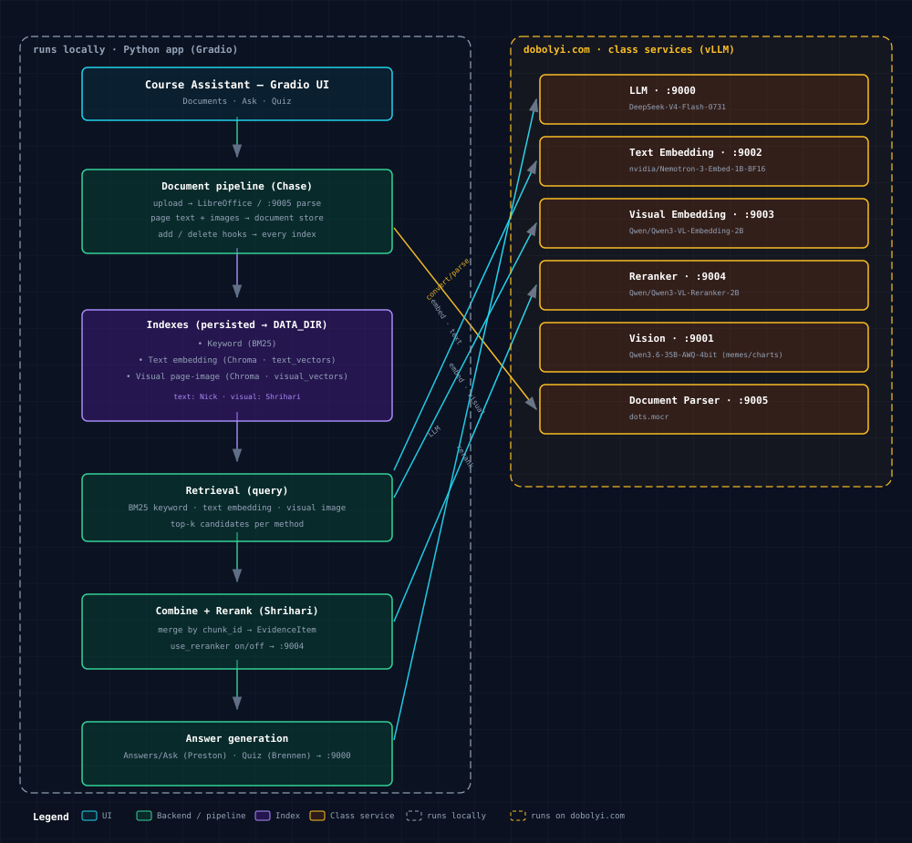

# Course Assistant

MBAX 6418 Assignment 2. A Python app that answers questions about course
materials and generates practice quizzes, using hybrid RAG (keyword search,
text embeddings, and slide-image embeddings, combined and reranked) with the
class services.

> Work in progress. Sections below get filled in by each owner.

## Setup

Requires Python 3.12 and [LibreOffice](https://www.libreoffice.org/) (for PPTX upload).

```bash
git clone https://github.com/brennen-field/DavidsClass-assignment2.git
cd DavidsClass-assignment2
python -m venv .venv
source .venv/bin/activate        # Windows: .venv\Scripts\activate
pip install -r requirements.txt
cp .env.example .env             # then fill in real values; never commit .env
python app.py
```

The text-embedding client reads the class credential only from
`CLASS_API_KEY` in the local `.env`. Keep the provided `TEXT_EMBED_URL` and
`TEXT_EMBED_MODEL` values unchanged unless the instructor updates the service.

Run tests with `pytest`.

Pull requests also run the full mocked test suite through GitHub Actions; no
class API key is provided to or required by CI.

## Architecture



The left dashed region runs **locally** as the Python app; the right dashed
region is the class services on **dobolyi.com**. Retrieval combines keyword
(BM25), text-embedding, and page-image (visual) results, merges them by
`chunk_id`, and reranks them (toggle via `use_reranker`) so answer generation
gets the best text-and-image evidence.

## Project layout

| Folder | Owner | Part |
|---|---|---|
| `course_assistant/documents/` | Chase | Upload, conversion, page text + images, duplicates, removal |
| `course_assistant/text_search/` | Nick | Chunking, BM25, text embeddings |
| `course_assistant/visual_search/` | Shrihari | Image embeddings, combining, reranking |
| `course_assistant/answers/` | Preston | LLM answers with sources |
| `course_assistant/quiz/` | Brennen | Quizzes; `app.py` shell |
| `docs/` | Everyone | Handoff specs, diagram |

## Team workflow

- Work on your own branch (e.g. `chase/documents`), open a PR, get one review, then merge.
- Never push to `main` directly. Never commit `.env` or keys.
- Review rotation: Chase → Nick → Shrihari → Preston → Brennen → Chase.
